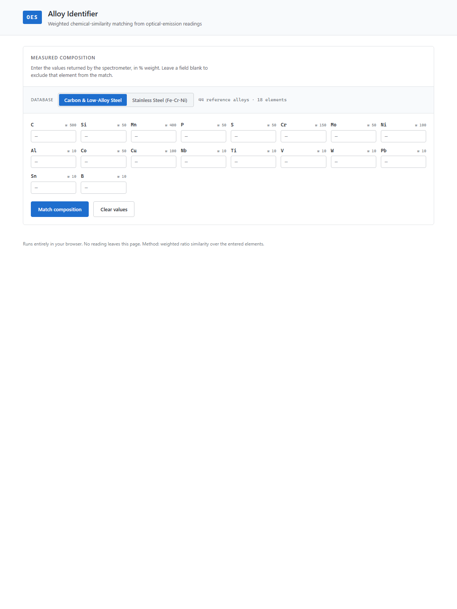

# OES Alloy Identifier

A browser-based tool for identifying the probable grade of a metallic alloy from raw optical-emission spectrometry (OES) readings.

**[Live app →](https://materials-selector-wealthfinpilot.netlify.app)**



---

## The problem

In a metallurgical laboratory, an OES spectrometer returns relative intensities for 20+ chemical elements simultaneously. Translating those readings into a probable alloy grade traditionally relied on the technician comparing values by eye against printed reference tables — a method that becomes unreliable as soon as several elements vary at once.

The result: subjective identification, non-reproducible across operators, and slow under workload.

## The solution

The tool compares a measured composition against a reference database of known alloys using a weighted chemical-similarity metric. Each element is assigned a metallurgical weight that reflects its discriminating power (carbon and manganese matter more than trace elements in carbon steels; chromium and nickel dominate in stainless). For each reference alloy, the tool computes:

```
sim_i = min(x_i, s_i) / max(x_i, s_i)          per element, ∈ [0, 1]
Score = Σ(w_i · sim_i) / Σ w_i                  weighted average
```

where `x_i` is the measured value and `s_i` the reference composition for element `i`. Only the elements actually entered by the user contribute to the score, so a partial reading still produces a ranked result. The output is a sorted shortlist of the most probable grades with a percentage score.

## Databases

| Database | Alloy family | Reference alloys | Elements |
|---|---|---|---|
| Carbon & Low-Alloy Steel | Fe-C base | 44 | 18 |
| Stainless Steel (Fe-Cr-Ni) | Austenitic / martensitic | 12 | 18 |

Reference compositions are sourced from certified standard materials (BCS, IARM, CRM series).

## Stack

Vanilla HTML / CSS / JavaScript — no framework, no build step, no backend. All computation runs in the browser. The reference data is loaded as static JSON at startup.

Deployed as a static site on Netlify.

## Local setup

```bash
# any static file server works — needed for ES module imports
python -m http.server 8000
# then open http://localhost:8000
```

Run the engine unit tests (Node, no dependencies):

```bash
node test/engine.test.mjs
```

## Repository layout

```
data/          reference databases (JSON, extracted from the source workbook)
src/
  engine.js    pure matching engine — normalisation, similarity, ranking
  main.js      UI — form, silo selection, result rendering
  style.css    design system (OKLCH palette, WCAG AA)
test/
  engine.test.mjs   identity and unit tests (44/44 Fe01, 12/12 Fe30)
docs/
  source-analysis.md   algorithm derivation and data inventory
  architecture.md      technical decisions
```
